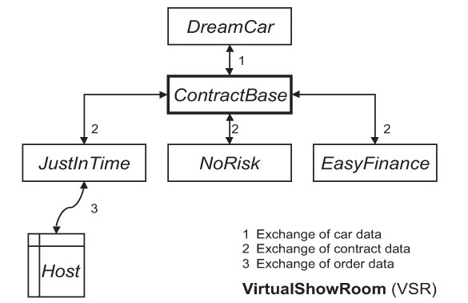

### Memo for myself
1. Not all kinds of tests would be used in the real-world cases,
    - since some of the software aren't that *complex* & *complicated* :)


### Arch. of the *VirtualShowRoom* <small>( for cars )</small>
- It's a *electronic sales support system* <small>( use *app* instead of *people* )</small> :D 
- SUB :: **DreamCar** 
    - shows possible models & combs and calc its prices 
- SUB :: **EasyFinace**
    - kinda like ?bank, access what ways should I bought this <small>( 3/5-years loan )</small>
- SUB :: **JustInTime**
    - place the order online 
- SUB :: **NoRisk**
    - cars' insurance 
- SUB :: **ContractBase**
    - data management that contains info of *people* & *contract*
- Process illustration<br>
    
- Process explanation
    - Place order (in a broader sense)
        - send to data-manager
            - to car
                - comb & calc price
            - to 3rd-party
                - insurance
                - finacial assessment

----- 

### Error-related terms 
- For people <small>( aka *programmer* )</small> 
    - "they" causes *errors*, *mistakes* 
- For software, it appears as *bug*.
    - It also could be called as *fault*, *defect*, even *internal error* :P
- For end-users <small>( or testers )</small>
    - the problems they met are called *failure*, *problem*, *issue*, *incident* etc.
  
### Testing
- *Debug*
    - Longer
        - There's an error|bug occured.
        - Programmers are trying to ***FIND*** the **precise location** & fix this.
    - Shorter
        - *Localizing* & *correcting* faults.
- *Testing* itself
    - Goals <small>( in cmp to *debug* )</small>
        - Systematically detecting where the defects live.
    - What 
        - Execution with samples|condition, 
        - and then check if it reachs the expected behaviors ( ≈ *requirements* ).
    - Purposes
        1. Find failures: apparently it's most of the cases.
        2. Measure quality: e.g. ```test coverage: 80%``` :D
        3. Provide *confidence*: IMHO, it's kinda the same goal as **Continuous Integration** !
        4. Decision making: ha, very similar to the 3rd one.
        5. Prevent failures: hmm <small>( e.g. analyzing *programs* or *docs* )</small>.
- Test :: process
    - test-data
    - planning, design 
    - implementation 
    - analysis of test (test management)
- Test :: process :: terms 
    - *Test case*: it contains **defined test conditions**, e.g. calc '1+1' should return '2'.
    - *Test suite*: it contains *one or more* test cases.
- Test :: multiple as one 
    - Several test cases are combined as one as **test scenarios**,
        - whereby the result of one test case is used for the next following test.
    - e.g. *a test scenario relateds to DB*
        1. write a date into the DB
        2. change the date that have been written 
        3. reaing the changed date & deleting it :D 
    - After the tests have been exec_ed, 
        - the DB should be in the same state as before exec_ing the tests.
- Principle :: No large software system is *bug-free*
    - Specifically, this is for *complex* softwares.
    - Often the reason is that **certain exceptional cases weren't considered during dev & testing**.
- Principle :: Testing cannot produce absence of defects 
    - You mightn't able to say *'this app has no bug'* even your tests have been *100% passed* <small>( ha? )</small>.
- Method :: Naming tests <small>( hmm )</small>
    - Objective: *test_load_file*, *test_db_connection*
    - Technique: *test_realworld_scenarios_based_process*
    - Object: *test_database*, *test_SSH*
    - Level: *test_system_test*, *test_component_test*
    - Person: *test_user_acceptance*
    - Extent: *test_regression_test* <small>( keyword: **TDD**, **CI/CD** )</small>
    

### Software quality
- Factors 
    1. Functionality
    2. Reliability
    3. Efficiency
    4. Maintainability
    5. Portability
- Detail :: Functionality
    - It refers to *every required capability was implemented <small>( as described in the spec )</small>*.
        - For testing, each of those *capabilities* should be genrating the **correct** results.
    - It must **interoperate** with other systems <small>( OS | Other softwares )</small>.
        - For testing, it should be able to detect trouble with the **cooperation**.
    - It should be *fulfuilling user-specific standards*, like *contracts*, *laws* etc.
        - For testing, it <small>( from security aspect )</small> must show how the data being protected/breached.
- Detail :: Reliability
    - It refers to *a system that still functioning under specific use/period*.
    - Examples  
        - Will the software crash if there's an env-failure, wrong use of interface etc. ?
        - Can the software recover <small>( fast & easily )</small> the data after it crashed ?
        - Does it have a nice interface?
        - Does it have a nice interface & easy to use?
- Detail :: Efficiency
    - Time:&nbsp;&nbsp;&nbsp;&nbsp;&nbsp;&nbsp;&nbsp;&nbsp;&nbsp;&nbsp; e.g. Execution, testing
    - Resource:&nbsp;&nbsp;&nbsp; e.g. Hardware, storage, network 
- Detail :: Maintainability
    - It should be *easy-to-analyze/test*, *not-hard-to-make-changes*, *stable-as-fuck* :P
- Detail :: Portability
    - It should be *adapted-ah-not-bad*, *similar-UI*, *easy-to-replace-as-component* :P
- Test effort
    - Again, *testing cannot prove the absense of faults*.
    - *"Testing'd continue ala. costs of find/correcting a defect are l.t. the costs of failure"*.

### Test cases
- Expected / UnExpected
    1. **examining the specified behavior/input/reaction**.
        - It also includes *the right 'exception' when the error occurs :P
        - For some pre-cond, it's often not that easy to create, such as *'network conn overload'* <small>( LOL )</small>.
    2. Examining the reaction of test objects to invalid/unexpected inputs/cond 
        - that is, *error handling* :D 
- Logical / Concrete
    1. One for range 
    2. One for specific values

-----

### The Psychology of Testing 
- Who should do it
    - By yourself
        - *Unlearn* your program.
    - By testers
        - Objective & no-bais.
        - Yet, *learning* other people's program takes time.
- Some general principles 
    1. Testing can *show defects*, but it can't be called 'bug-free' even ur tests is '100% passed.'
    2. Exhaustive testing cannot be done. Tests should be prioritized.
    3. Testing activities should start as early as possible.
    4. Defects categorizing.
