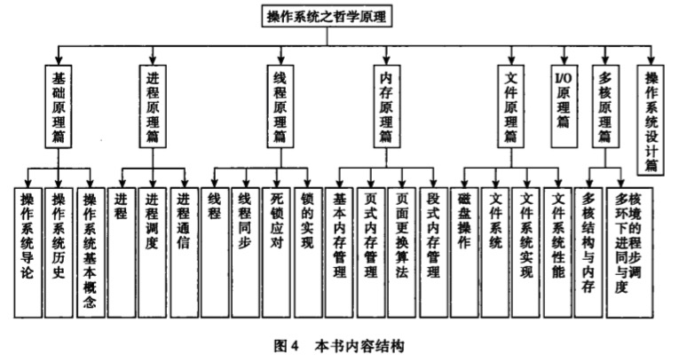

### 前言
- 读者原话
    > <q>本书就是试图从这些哲学原理 <small>( 也是就是人类生活哲学 )</small> 的视角 来阐述操作系统, 从而揭开操作系统的神秘面纱.</q>

    > <q>从人类自然的行为规范推演到操作系统的设计, 以一条逻辑主线演绎了整个操作系统的各种原理.</q>

- 个人总结
    > 以人类为例 来讲述操作系统各项功能 与其设计上的 principle
    
- 内容梗概
     
    
